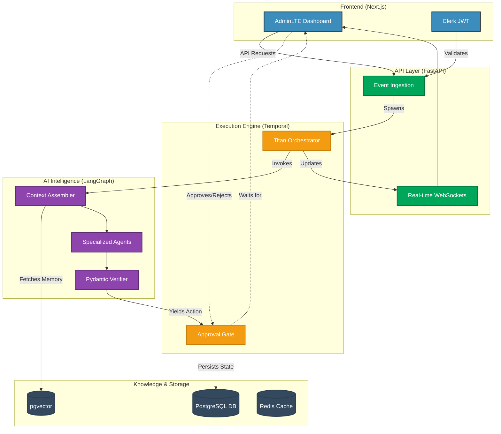

# ⚡ TITAN 🤖💼
[](https://github.com/arslanvuzmal/titan/actions/workflows/ci.yml)
[](#)

**Autonomous AI Business Operations Platform**

## CI/CD & Testing

TITAN features a massive multi-layered testing suite and strict CI/CD pipeline.

### Running Tests Locally
To debug CI/CD failures before pushing, run the debug script:
```bash
./scripts/debug_ci.sh
```

### Troubleshooting
If the GitHub Actions pipeline fails:
1. Ensure `apps/api/pyproject.toml` is valid and the environment installs cleanly.
2. Ensure you have no ESLint warnings using `pnpm lint` in `apps/web`.
3. Check the Actions log in GitHub for specific `ruff`, `black`, `mypy`, or `tsc` failures.

---


TITAN is an enterprise-grade platform that orchestrates autonomous AI agents to handle complex business operations, from inbound sales qualification to deep market research. It utilizes a durable execution engine to guarantee state persistence and seamlessly integrates human-in-the-loop (HITL) approval workflows before taking sensitive actions.

---

## 🏛️ Architecture

TITAN utilizes a highly decoupled, event-driven architecture powered by LangGraph for AI state management and Temporal for durable orchestration.



---

## 🛠️ Tech Stack

**Frontend:** Next.js 14 (App Router), React, TailwindCSS, AdminLTE UI aesthetics, Recharts, Clerk Auth.  
**Backend:** FastAPI, Python 3.11, Pydantic V2.  
**AI Orchestration:** LangGraph, LangChain.  
**Durable Execution:** Temporal.io.  
**Database & Vector Store:** PostgreSQL (via Prisma), `pgvector`.  
**Infrastructure:** Docker Compose, Redis, pnpm, Turborepo.  

---

## 🚀 Quick Start (Local Development)

### Prerequisites
- Docker & Docker Desktop
- [Node.js v20+](https://nodejs.org/)
- [Python 3.11+](https://www.python.org/)
- [pnpm](https://pnpm.io/) (`npm i -g pnpm`)
- [uv](https://github.com/astral-sh/uv) (`curl -LsSf https://astral.sh/uv/install.sh | sh`)

### 1. Clone & Install
```bash
git clone https://github.com/your-org/titan.git
cd titan

# Install Monorepo Node dependencies
pnpm install

# Install Python backend dependencies
cd apps/api
uv pip install -e .[dev]
```

### 2. Environment Variables
Copy the templates and fill in your keys (especially `CLERK_SECRET_KEY` and `OPENAI_API_KEY`).
```bash
cp .env.example .env
cp apps/api/.env.example apps/api/.env
cp apps/web/.env.local.example apps/web/.env.local
```

### 3. Start Infrastructure & Database
Ensure Docker is running, then boot up Postgres, Redis, and Temporal.
```bash
# In the root directory
docker-compose up -d

# Push the Prisma schema to the database
pnpm db:push
```

### 4. Run the Stack
Start the frontend, FastAPI server, and Temporal worker in parallel.
```bash
pnpm dev
```

The Dashboard will be available at `http://localhost:3000` and the API Swagger docs at `http://localhost:8000/api/docs`.

---

## 🛡️ Strict Tenant Isolation

TITAN is built for multi-tenancy. At the core of the data access layer and the RAG pipeline, every database transaction and vector search is strictly filtered by `organization_id`. The Context Assembler enforces this at the code level, guaranteeing that an AI Agent operating on behalf of Tenant A cannot access documents uploaded by Tenant B.

## 🤝 Contributing
Code quality is enforced via GitHub Actions and `pre-commit`. Before pushing, ensure your code passes:
```bash
pre-commit run --all-files
```
