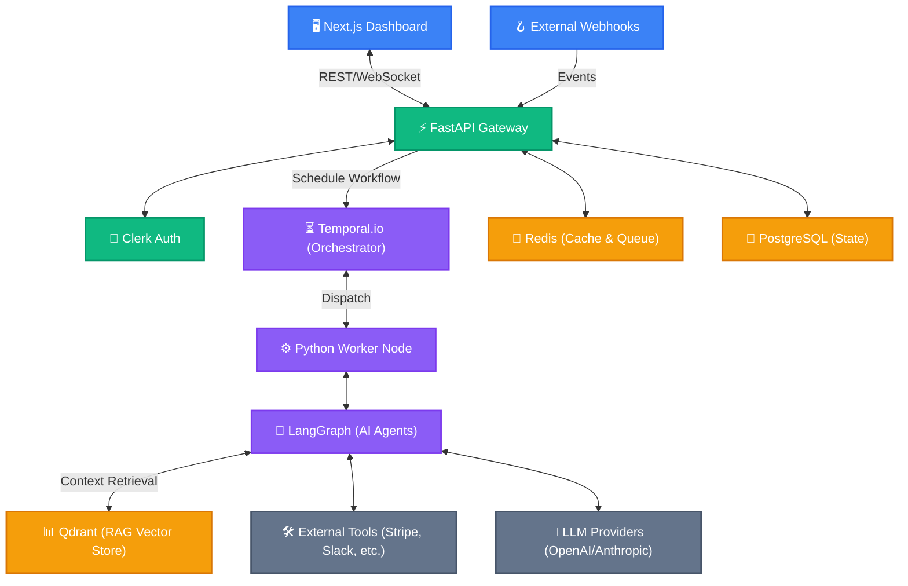

# TITAN: Autonomous AI Business Operations Platform

<div align="center">
  
  
  
  
</div>

<br />

**TITAN** is an enterprise-grade, event-driven AI operations platform designed to automate complex business workflows with human-in-the-loop oversight. Built for scale, observability, and absolute reliability.

---

## 🏗️ Architecture

The entire system is orchestrated via an event-driven loop backed by Temporal and LangGraph, enabling resilient AI workflows that can pause for human feedback and resume automatically.



---

## 🚀 Key Features

TITAN is built across a robust **16-step Golden Path** ensuring production readiness:
- **Human-in-the-Loop (HITL):** AI agents automatically suspend execution and request human approval for high-risk actions.
- **Resilient Workflows:** Powered by Temporal, workflows survive server crashes, rate limits, and network partitions with automatic retries.
- **Retrieval-Augmented Generation (RAG):** Context-aware AI agents utilizing a vector database for semantic search and precise answers.
- **Enterprise Security:** JWT-based authentication via Clerk, Role-Based Access Control (RBAC), and secrets management.
- **Full Observability:** Distributed tracing (OpenTelemetry), PromQL metrics, and structured JSON logging.

---

## 🛠️ Tech Stack

| Category | Technologies |
|---|---|
| **Frontend** | Next.js 14, React 19, Tailwind CSS v4, Recharts, Lucide Icons |
| **Backend** | Python 3.11, FastAPI, Pydantic, Prisma Client Python |
| **AI & Orchestration** | LangGraph, LangChain, Temporal.io |
| **Data Infrastructure** | PostgreSQL, Redis, Vector DB (Qdrant) |
| **DevOps & CI/CD** | Docker, Docker Compose, GitHub Actions, GHCR |

---

## 💻 Local Setup

Getting TITAN running locally is frictionless. The entire backing infrastructure runs in Docker.

### 1. Start the Infrastructure
```bash
docker-compose up -d
```
*This spins up PostgreSQL, Redis, and the Temporal Server.*

### 2. Install Dependencies
**Backend (FastAPI)**
```bash
cd apps/api
uv pip install -e .[dev]
```

**Frontend (Next.js)**
```bash
cd apps/web
pnpm install
```

### 3. Run the Development Servers
Open two terminals:
```bash
# Terminal 1: Backend
cd apps/api
uvicorn app.main:app --reload
```

```bash
# Terminal 2: Frontend
cd apps/web
pnpm dev
```

---

## 📸 Screenshots

*(Replace these placeholders with actual screenshots of your dashboard)*


*The main operations control center.*


*Real-time observability into the LangGraph AI decision loops.*
